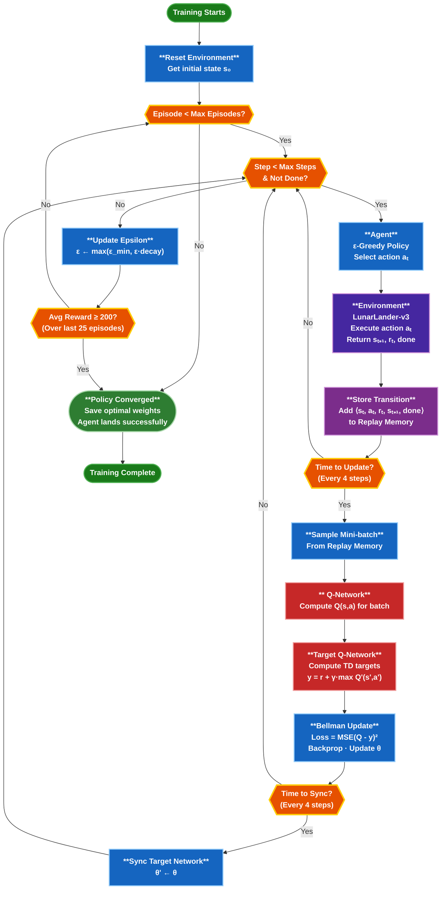

# 🚀 Lunar Landing Program Using Reinforcement Learning

An AI-powered simulation that trains an intelligent agent to **autonomously land a spacecraft using Deep Reinforcement Learning (DRL)**.
The agent learns optimal landing strategies using the **Deep Q-Network (DQN)** algorithm by interacting with the **OpenAI Gym LunarLander environment**.

This project demonstrates how reinforcement learning enables machines to **learn complex control tasks through trial and error**.

# Project Demonstration
- ## Before Training
<p align="center">
  
</p>

- ## After Training
<p align="center">
  
</p>

---

# 📌 Project Overview

Landing a spacecraft safely requires controlling velocity, direction, and position simultaneously.

In this project:

* An **RL agent interacts with the LunarLander environment**
* The agent receives **rewards and penalties**
* A **Deep Q-Network** learns the best actions
* Over multiple episodes, the agent learns how to land safely.

The goal is to **maximize cumulative rewards while achieving stable landing behavior**.

---

# 🧠 Key Reinforcement Learning Concepts

### Deep Q Network (DQN)

A neural network approximates the **Q-value function**, which estimates the expected reward for each action in a given state.

### Experience Replay

Past experiences are stored in memory and randomly sampled during training to improve learning stability.

Experience tuple:

```text
(state, action, reward, next_state, done)

```

### Target Network

A separate network used to calculate stable target Q-values during training.

### Exploration vs Exploitation

The agent follows an **epsilon-greedy strategy**:

* Exploration → Random actions
* Exploitation → Best predicted action

Epsilon gradually decreases during training.

### Bellman Equation

Q-values are updated using:

```text
Q(s,a) = r + γ max Q(s',a')

```

Where

* r = reward
* γ = discount factor
* s' = next state

---

# 🏗️ System Architecture



---

# ⚙️ Technologies Used

* Python
* PyTorch
* NumPy
* OpenAI Gym
* Matplotlib
* Pandas
* Jupyter Notebook

---

# 📂 Project Structure

```text
Lunar-Landing-Program-Using-Reinforcement-Learning/
│
├── Images/
│   ├── After_training.webp
│   ├── before_training.webp
│   ├── bellman adaptation equation.PNG
│   ├── detach function.PNG
│   ├── example of max and unsqueeze.PNG
│   ├── exploration vs explotation.PNG
│   ├── local vs target.PNG
│   ├── Loss of Agent.PNG
│   ├── loss function.PNG
│   ├── next_Q_targate.PNG
│   ├── Replaymemory.PNG
│   ├── Soft Update.PNG
│   └── unsqueez.PNG
│
├── video_training/               
│   ├── rl-video-episode-0.mp4
│   ├── rl-video-episode-25.mp4
│   ├── rl-video-episode-50.mp4
│   └── ... (other recorded episodes)
│
├── Lunar Landing Program Using RL.ipynb
├── Lunar Landing Program Using RL.pdf
├── Lunar_Landing_agent.pth
├── Readme.md
└── requirements.txt

```

---

# 🔧 Hyperparameters

| Parameter | Value |
| --- | --- |
| Learning Rate | 0.0005 |
| Discount Factor (γ) | 0.99 |
| Replay Buffer Size | 100000 |
| Batch Size | 150 |
| Episodes | 5000 |
| Max Steps | 1000 |
| Epsilon Start | 1.0 |
| Epsilon End | 0.01 |

---

# 📊 Training Process

Training follows these steps:

1. Reset the environment
2. Observe the current state
3. Select action using epsilon-greedy policy
4. Perform action
5. Receive reward and next state
6. Store experience in replay memory
7. Sample mini-batch
8. Update Q-network

Over time, the agent learns to perform **stable lunar landings**.

---

# 📈 Results

During training:

* Episode rewards increase gradually
* Landing becomes more stable
* The agent learns efficient control strategies

Performance is evaluated using **episode scores and rolling average rewards**.

## Agent Training Progress

# ▶️ How to Run the Project

### 1 Clone the repository

```bash
git clone https://github.com/udityamerit/Lunar-Landing-Program-Using-Reinforcement-Learning.git

```

### 2 Install dependencies

```bash
pip install torch gym numpy matplotlib pandas

```

### 3 Run the notebook

Open the notebook:

```bash
Lunar Landing Program Using RL.ipynb

```

Run all cells to start training the agent.

---

# 🎯 Applications

This project demonstrates reinforcement learning applications in:

* Autonomous spacecraft landing
* Robotics control
* Autonomous vehicles
* Game AI
* Decision-making systems

---

# 👨‍💻 Author

**Uditya Narayan Tiwari**
B.Tech Computer Science Engineering (AI & ML)
VIT Bhopal University

🌐 Portfolio
[https://udityanarayantiwari.netlify.app/](https://udityanarayantiwari.netlify.app/)

💻 GitHub
[https://github.com/udityamerit](https://github.com/udityamerit)

📚 Knowledge Base
[https://udityaknowledgebase.netlify.app/](https://udityaknowledgebase.netlify.app/)

```

```